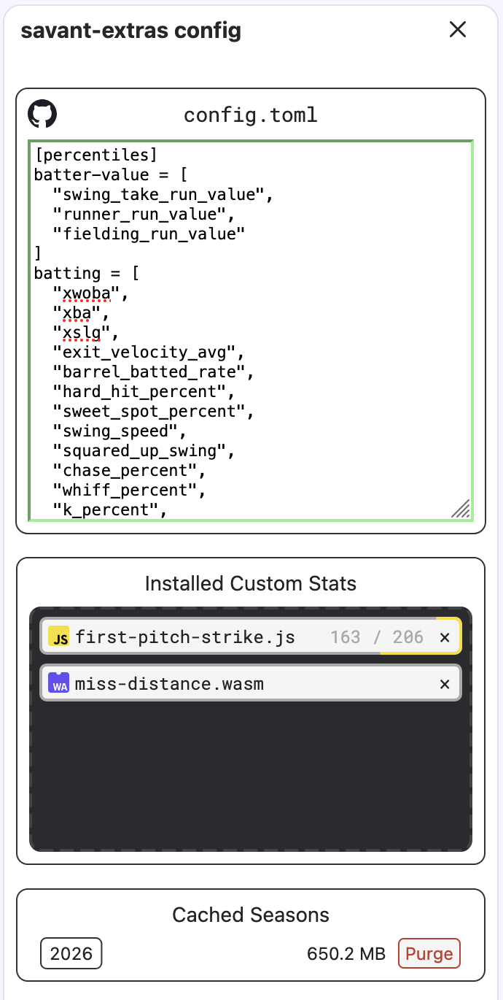

# Baseball Savant Extras
An extension for Baseball Savant to add custom stats.

# Installation

Releases are on the **Releases** tab on the RHS.

Firefox: Drag and drop the `xpi` file anywhere on a Firefox window to install for firefox.
Chrome: Go to [chrome://extensions](chrome://extensions) and drag and drop the `zip` file. (Web Store coming soon™)

# Usage
Baseball Savant Extras is operated entirely by its [sidebar](https://developer.mozilla.org/en-US/docs/MDN/Writing_guidelines/Page_structures/Sidebars).

`config.toml` holds the general config for baseballsavant-extras in a [TOML](https://toml.io/en/) format.

## `[percentiles]`
`[percentiles]` holds the percentile stats names to be shown for each section.

MLB actually provides more stats than what is typically shown (such as EV50), the full list of these built-in stats can be found [here](markdown/BUILTIN_MLB_STATS.md).

Custom stats are registered here with their internal name (ex: `miss_distance` or `first_pitch_strike`)

Note: As of right now, if MLB comes out with new stats for their webpage, this list will not automatically add it, you'll need to be aware what the new stat's internal name is (likely by checking [BUILTIN_MLB_STATS.md](markdown/BUILTIN_MLB_STATS.md)) and add it yourself.

## `[active-seasons]`
`[active-seasons]` stores the settings for which seasons to download locally for custom stat calculcations (see [Custom Stats](#custom-stats) for more details).

* `include-current` includes the current season in the list of downloaded seasons.
* `seasons` is a list of seasons to download, ex: `[2024, 2025, 2026]`.

Note: The file sizes shown are their uncompressed sizes. Your browser will apply some compression algorithm to this, meaning the size on disk is likely ~1/3 of the shown size.

## `[active-stats]`
`[active-stats]` stores the list of custom stats that will be actively calculcated and kept up-to-date.

# Custom Stats
Custom Stats are the main feature of Baseball Savant Extras. On the "Installed Custom Stats" pane, you can drag and drop valid JS & WASM files defining custom stats. These stats will automatically take downloaded play-by-play data from select seasons (if enabled in `[active-stats]`), and run their statistical analysis on it to produce their results.

As can be seen above in the sidebar screenshot. The `first-pitch-strike.js` file is currently running through 206 downloaded dates, once it's complete it will be visible on pages implementing it.

If you wish to develop your own custom stats or learn more about how they work under the hood, see [MAKING_CUSTOM_STATS.md](markdown/MAKING_CUSTOM_STATS.md)
